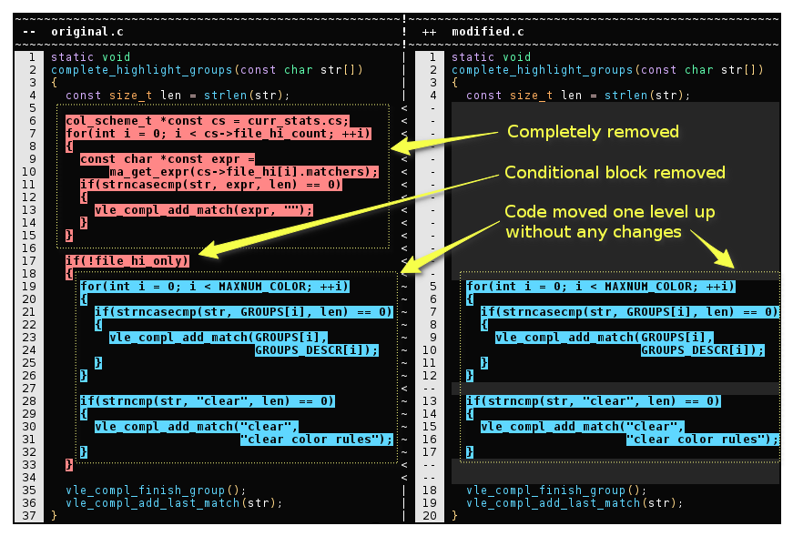

**zograscope**, _2017 - 2024_



**Clone recursively, there are submodules:**

```bash
git clone --recursive https://github.com/xaizek/zograscope.git
```

1. [Description](#description) ([Status](#status);
                                [Supported languages](#supported-languages);
                                [Configuration](#configuration))
2. [Tools](#tools)
3. [Building and Installing](#building-and-installing)
   ([Dependencies](#dependencies))
4. [Documentation](#documentation)
5. [License](#license)
6. [Credits](#credits)
   ([References](#references))

## Name ##

"A zograscope is an optical device for enhancing the sense of depth perception
from a flat picture." ([wiki][wiki-zograscope])

## Description ##

`zograscope` is built around syntax-aware diff and includes a number of
additional tools.

The nature of syntax-aware diff requires knowledge of structure of the code,
which can be used to build other simple tools that can benefit from this
information.  Competing with real language front-ends in the level of accuracy
is not possible, but making some things that are one step further than regular
text-processing utilities seems feasible and the result might be even more
practical than some of the more elaborate tools which end up requiring
complicated setup process.

### Status ###

The project is work in progress, but is useful in its current state.

Code isn't perfect and isn't extensively documented as initial version was more
of an experiment, but this situation gets better.

## Documentation ##

See the [manual page](./docs/zograscope.md).

## Tools ##

### [zs-diff](tools/diff/README.md) ###

A terminal-based syntax-aware diff.

### [zs-find](tools/find/README.md) ###

Grep-like tool that finds elements of source code structure.

### [zs-gdiff](tools/gdiff/README.md) ###

A Qt5 GUI version of syntax-aware diff.

### [zs-hi](tools/hi/README.md) ###

Simple syntax highlighter for xterm-256color palette.

### [zs-stats](tools/stats/README.md) ###

Counter of lines of code.

### [zs-tui](tools/tui/README.md) ###

TUI interface with underdefined scope of functionality.

## Building and Installing ##

```bash
# if Qt5 is available (use `qmake` if it corresponds to Qt5 on your machine)
echo 'QT5_PROG := qmake-qt5' >> config.mk
# if libgit2 is present
echo 'HAVE_LIBGIT2 := yes'   >> config.mk
# if libsrcml is present
echo 'HAVE_LIBSRCML := yes'  >> config.mk
# if cursesw is present
echo 'HAVE_CURSESW := yes'   >> config.mk

make release check
```

This will build release version and run tests.  The executables will be named
`release/zs-*`.

There is no data, so just making them available in the `$PATH` will work.
However, it's possible to install conventionally (`/usr` prefix by default):

```
make install
```

`DESTDIR` and `PREFIX` can be set to modify destination location.  On invoking
`make uninstall` same values of these values should be specified.

### Dependencies ###

* [GNU Make][make]
* C++11-capable compiler (GCC 4.9 has some issues, GCC 5.3 works fine)
* [flex][flex]
* [GNU Bison][bison] v3+
* [Boost][boost], tested with 1.58, but older versions might work too
* (optional, run- or build-time, for C++) [srcml][srcml] (v0.9.5 and v1.0.0 were
  tested)
* (optional, for `gdiff` tool) [qt5][qt5]
* (optional, for `gdiff` tool) [libgit2][libgit2]
* (optional, for `tui` tool) [curses][curses] with support of wide characters
* (optional) [pandoc][pandoc] for regenerating man pages

#### For Debian-based distributions ####

If you are using Debian or one of its derivatives, you can install the
dependencies as follows:

```bash
# install make and build tools
sudo apt install -y build-essential
# installing dependencies
sudo apt install -y libboost-filesystem-dev libboost-iostreams-dev
sudo apt install -y libboost-program-options-dev libboost-system-dev
sudo apt install -y libarchive13
sudo apt install -y bison flex
# installing srcml
wget http://131.123.42.38/lmcrs/beta/srcML-Ubuntu18.04.deb
sudo apt install ./srcML-Ubuntu18.04.deb
```

You can also check out the [CI build script](data/appveyor/ubuntu.sh) in case
dependencies change in the future.

## License ##


Version 3 of the GNU Affero General Public License.

## Credits ##

[dtl library][dtl] is used for finding edit distance.

[pmr implementation][pmr] from C++17 with a small addition is employed for
custom allocators.

[TinyXML2][tinyxml2] is used for parsing XML.

[tree-sitter][tree-sitter] is used for parsing of some languages.

[Catch2][catch] is used for tests.

### References ###

[Change Distilling: Tree Differencing for Fine-Grained Source Code Change
Extraction][cd].
Beat Fluri, Michael Würsch, Martin Pinzger, and Harald C. Gall.
2007.

[Change Detection in Hierarchically Structured Information][hier].
Sudarshan Chawathe, Hector Garcia-molina and Jennifer Widom.
1996.

[Simple fast algorithms for the editing distance between trees and related
problems][ted].
Kaizhong Zhang and Dennis Shasha.
1989.

[wiki-zograscope]: https://en.wikipedia.org/wiki/Zograscope

[make]: https://www.gnu.org/software/make/
[flex]: https://github.com/westes/flex
[bison]: https://www.gnu.org/software/bison/
[boost]: http://www.boost.org/
[srcml]: http://www.srcml.org/
[qt5]: https://www.qt.io/
[libgit2]: https://libgit2.org/
[curses]: https://en.wikipedia.org/wiki/Curses_(programming_library)
[pandoc]: https://pandoc.org/

[dtl]: https://github.com/cubicdaiya/dtl
[pmr]: https://github.com/phalpern/CppCon2017Code
[tinyxml2]: https://github.com/leethomason/tinyxml2
[tree-sitter]: https://tree-sitter.github.io/
[catch]: https://github.com/catchorg/Catch2

[cd]: http://www.merlin.uzh.ch/publication/show/2531
[hier]: http://citeseerx.ist.psu.edu/viewdoc/summary?doi=10.1.1.48.9224
[ted]: http://citeseer.ist.psu.edu/viewdoc/summary?doi=10.1.1.460.5601
