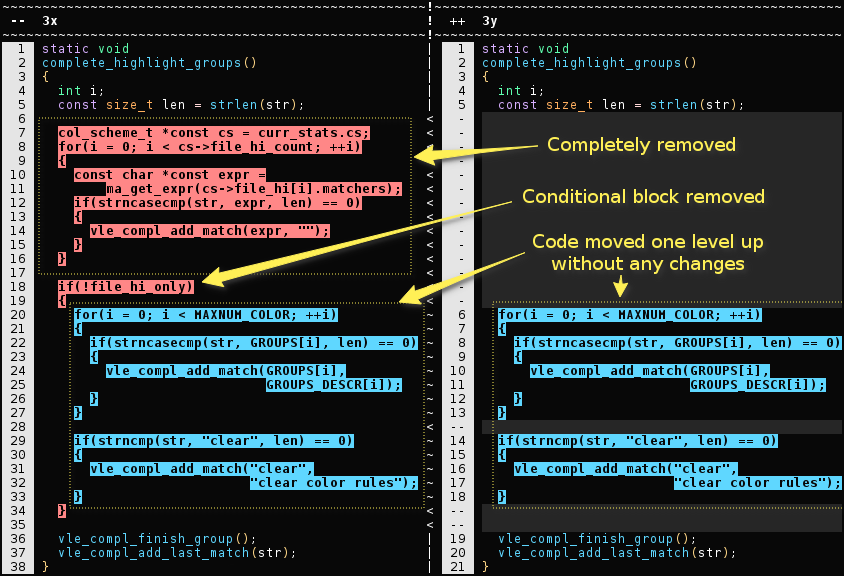

**zograscope**, _2017_



## Name ##

"A zograscope is an optical device for enhancing the sense of depth perception
from a flat picture." ([wiki][wiki-zograscope])

## Description ##

`zograscope` is built around terminal-based syntax-aware diff and can
potentially become a collection of tools.

The nature of syntax-aware diff requires knowledge of structure of the code,
which can be used to build other simple tools that can benefit from this
information.  Competing with real language front-ends in the level of accuracy
is not possible, but making some things that are one step further than regular
text-processing utilities seems feasible and the result might be even more
practical than some of the more elaborate tools which end up requiring
complicated setup process.

### Status ###

The project is work in progress, but is useful in its current state.

Code is quite bad and isn't really documented as initial version was more of an
experiment, but this should improve over time.

### Supported languages ###

#### C ####

The exact grammar is that of C11 with extensions implemented in popular
compilers and additional extensions needed to allow processing of code with
macros.

Note the following:
 * old K&R style of function declarations isn't parsed (there might be a
   workaround for it, but this syntax is deprecated either way)
 * preprocessor directives aren't tokenized yet (treated as a single entity),
   which doesn't seem to be a problem in practice
 * extensive use of macros in unusual places might not be parsed (this probably
   won't change)

Other than that code in C89, C99, C11 and GNU-versions of C language should be
recognized.

#### Other ####

More languages should be added in the future, maybe with external parsers that
are capable of preserving all information about the source code.

## Tools ##

### [zs-diff](tools/diff/README.md) ###

A terminal-based syntax-aware diff.

### [zs-hi](tools/hi/README.md) ###

Simple syntax highlighter for xterm-256color palette.

## Building ##

```
make release check
```

This will build release version and run tests.  The executables will be named
`release/zs-*`.

### Dependencies ###

* [GNU Make][make]
* C++11-capable compiler (GCC 4.9 has some issues, GCC 5.3 works fine)
* [flex][flex]
* [GNU Bison][bison]
* [Boost][boost], tested with 1.59, but older versions might work too

## Documentation ##

At the moment there is only `--help` option.

## License ##


GNU Affero General Public License, version 3 or later.

## Credits ##

[dtl library][dtl] is used for finding edit distance.

[pmr implementation][pmr] from C++17 with a small addition is employed for
custom allocators.

[Catch2][catch] is used for tests.

### References ###

[Change Distilling: Tree Differencing for Fine-Grained Source Code Change
Extraction][cd].
Beat Fluri, Michael Würsch, Martin Pinzger, and Harald C. Gall.
2007.

[Change Detection in Hierarchically Structured Information][hier].
Sudarshan Chawathe, Hector Garcia-molina and Jennifer Widom.
1996.

[Simple fast algorithms for the editing distance between trees and related
problems][ted].
Kaizhong Zhang and Dennis Shasha.
1989.

[wiki-zograscope]: https://en.wikipedia.org/wiki/Zograscope

[make]: https://www.gnu.org/software/make/
[flex]: https://github.com/westes/flex
[bison]: https://www.gnu.org/software/bison/
[boost]: http://www.boost.org/

[dtl]: https://github.com/cubicdaiya/dtl
[pmr]: https://github.com/phalpern/CppCon2017Code
[catch]: https://github.com/catchorg/Catch2

[cd]: http://www.merlin.uzh.ch/publication/show/2531
[hier]: http://citeseerx.ist.psu.edu/viewdoc/summary?doi=10.1.1.48.9224
[ted]: http://citeseer.ist.psu.edu/viewdoc/summary?doi=10.1.1.460.5601
