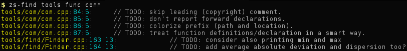

**[zograscope][zograscope] :: zs-find**

## Description ##

`zs-find` is a tool for searching in code.  Applications include things like
collecting crude statistics about the code, looking for certain nested
configurations or sequences tokens.

The syntax and matching abilities are relatively basic and are subject to
significant changes in the future.

## Documentation ##

See the [manual page][manual] for more details.

[zograscope]: ../../README.md
[manual]: ../../docs/zs-find.md
