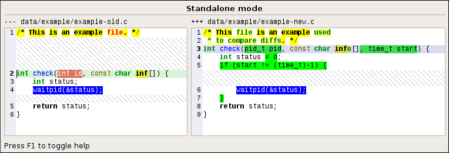

**[zograscope][zograscope] :: zs-gdiff**

## Description ##

`zs-gdiff` is a GUI syntax-aware diff that uses Qt5.  See [description of
zs-diff][zs-diff] for more details and comparison against other tools.

The tool can either accept two files on command-line, be integrated with `git`
by its means (yet using external GUI tools from `git` isn't very convenient in
general) or pick up list of changed files in the repository (staged or unstaged
in index or from a commit) by itself.  The latter way of using `zs-gdiff` with
`git` doesn't require any configuration and allows going through files without
restarting it, unlike when `git` invokes external tools.

### Status ###

There are some issues due to Qt's support for displaying code being in a quite
bad state.  However, the tool is usable.  The issues could be resolved or
different GUI toolkit could be used in the future.

## Documentation ##

See the [manual page][manual] for more details.

[zograscope]: ../../README.md
[manual]: ../../docs/zs-gdiff.md
[zs-diff]: ../diff/README.md
