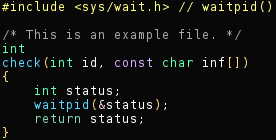

**[zograscope][zograscope] :: zs-hi**



## Description ##

`zs-hi` is a primitive code highlighter for terminal.  The main purpose is
testing and debugging of code parsing for `zs-diff`, but it can also be used on
its own.

The only hard-coded color scheme is for xterm-256color palette.

## Checking if code parses correctly ##

Whether the parser is able to handle given sources can be checked using command
like this:

```
find -name '*.[hc]' -exec zs-hi --dry {} \;
```

It produces output for files with which it has issues.

[zograscope]: ../../README.md
