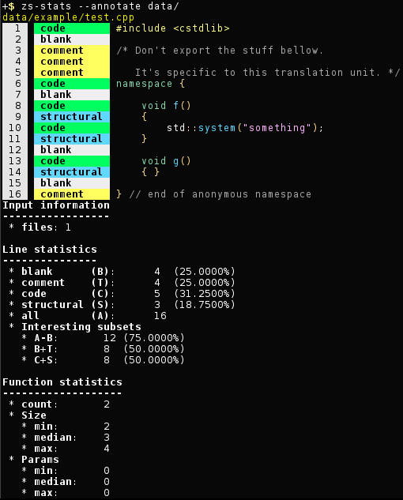

**[zograscope][zograscope] :: zs-stats**

## Description ##

`zs-stats` is a tool for counting lines of code (and possibly other things in
the future).

## Differences ##

Differences from some similar tools:
 * counts line containing only braces/brackets/parenthesis separately from code
 * blank lines inside multiline comments are counted as comments
 * blank lines inside string literals are counted as code
 * can be slower due to parsing source code instead of treating it as text
 * supports a few languages and new ones are harder to add
 * trailing blank lines are ignored (because there are no tree nodes for them,
   although it's possible to add them)
 * last line continuation in macros in C aren't recognized due to lack of
   tokenization of preprocessor directives; in C++ it might not be recognized
   due to srcml bugs

[zograscope]: ../../README.md
