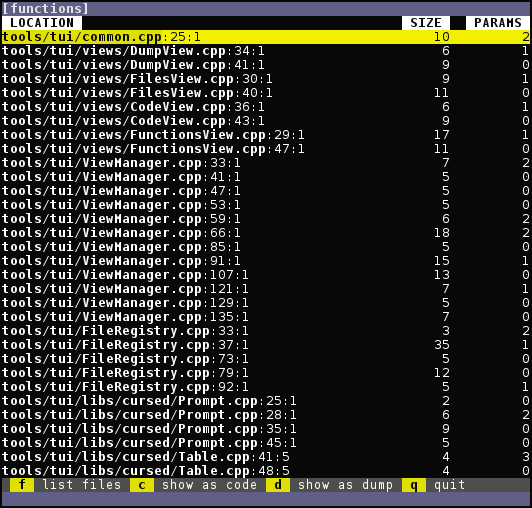

**[zograscope][zograscope] :: zs-tui**

## Description ##

`zs-tui` is a TUI version for processing files, whose scope is yet to be
defined.  So far it lists files or functions along with their size and parameter
count and allows viewing those items in source code as well as viewing dump of
their internal representation.

It's not clear if it's worth adding diffing functionality here.  It's probably
not, which means that this tool will be mostly for interactive browsing or
similar activities and other tools might be extracted out of it.

## Documentation ##

See the [manual page][manual] for more details.

[zograscope]: ../../README.md
[manual]: ../../docs/zs-tui.md
